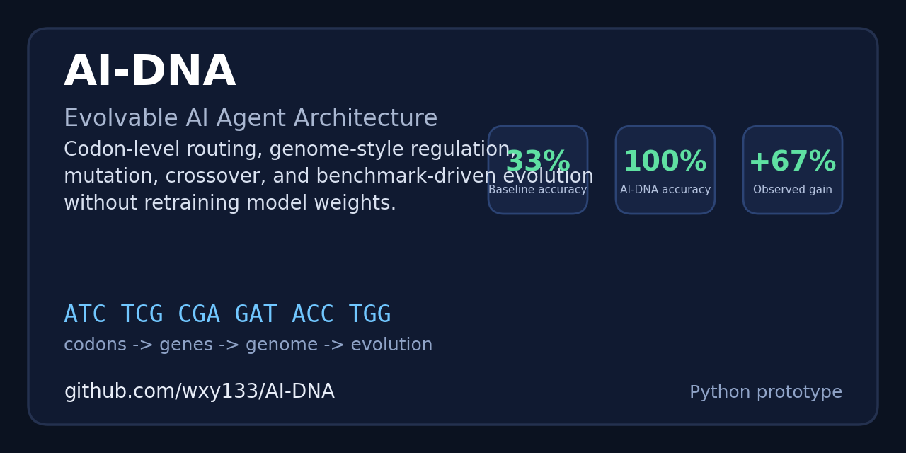
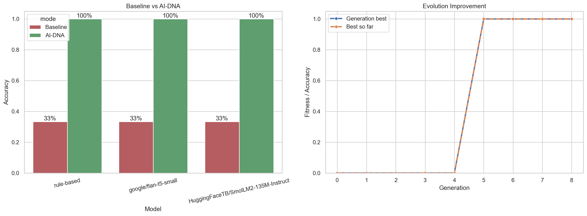

# AI-DNA

[](https://github.com/wxy133/AI-DNA/stargazers)
[](https://github.com/wxy133/AI-DNA/commits/main)
[](https://www.python.org/)

English | [????](README.zh-CN.md)

AI-DNA is a runnable prototype for an evolvable agent architecture inspired by biological DNA. Instead of treating intelligence as one monolithic model, it splits capability into small codon-like units, composes them into genes, regulates them with a genome, and lets the system improve through mutation, crossover, selection, and epigenetic tuning.



## Why this repo is worth checking

- It turns a pure concept document into a working Python prototype.
- It shows measurable gains without retraining the underlying model weights.
- It includes built-in benchmarking, evolution search, and report generation.
- It can wrap both a rule-based baseline and small Hugging Face models.

## Core idea

AI-DNA uses four layers:

1. `A/T/C/G` primitive operators.
2. Codon-to-skill mappings.
3. Gene execution pipelines.
4. A regulated genome that can evolve.

In the current prototype, math tasks route into exact-calculation codons, context QA routes into attention and memory codons, and general generation can still call a backing language model.

## Current result

On the built-in benchmark, AI-DNA lifted all tested backends from `33%` baseline accuracy to `100%` by using architecture-level routing and tools instead of changing model weights.

| Model | Baseline | AI-DNA | Gain |
| --- | ---: | ---: | ---: |
| rule-based | 33% | 100% | 67% |
| google/flan-t5-small | 33% | 100% | 67% |
| HuggingFaceTB/SmolLM2-135M-Instruct | 33% | 100% | 67% |



## What is implemented

- Primitive operators for attention, transformation, control, and generation.
- A codon registry with semantic understanding, logic reasoning, planning, text generation, arithmetic calculation, and memory storage.
- A DNA parser that decodes nucleotide sequences into executable codons.
- Genes and genomes with regulation rules and scenario-specific epigenetic marks.
- Evolution helpers for mutation, crossover, natural selection, and short search loops.
- A benchmark harness that compares a baseline model with AI-DNA-enhanced execution.
- A `report` command that regenerates charts, CSVs, JSON summaries, and a markdown report.

## Install

Core runtime:

```bash
pip install -e .
```

Hugging Face model support:

```bash
pip install -e .[hf]
```

Reporting and charts:

```bash
pip install -e .[report]
```

Everything:

```bash
pip install -e .[full]
```

## Quick start

Run the built-in demo:

```bash
python -m ai_dna demo
```

Run a single task:

```bash
python -m ai_dna run --task-type math --prompt "24 marbles are shared equally among 6 kids. How many marbles does each kid get?"
```

Compare a baseline model against AI-DNA:

```bash
python -m ai_dna benchmark --model google/flan-t5-small
```

Run a short evolution search:

```bash
python -m ai_dna evolve --generations 8 --population 12
```

Generate the full experiment report and charts:

```bash
python -m ai_dna report
```

The generated artifacts are written to `outputs/`.

## Recommended models to try

- `google/flan-t5-small` for a light first experiment on CPU.
- `HuggingFaceTB/SmolLM2-135M-Instruct` for a tiny instruction model baseline.

## Promotion kit

- Chinese README: [README.zh-CN.md](README.zh-CN.md)
- Share copy templates: [docs/promo-kit.md](docs/promo-kit.md)
- Citation guidance: [CITATION.md](CITATION.md)
- Full generated experiment report: [outputs/REPORT.md](outputs/REPORT.md)

## Repository layout

```text
ai_dna/
  benchmarks.py
  cli.py
  codons.py
  evolution.py
  genome.py
  models.py
  operators.py
  parser.py
  reporting.py
  runtime.py
assets/
outputs/
examples/
docs/
tests/
```

## Reproducibility

- Summary table: `outputs/benchmark_summary.csv`
- Per-sample outputs: `outputs/benchmark_details.csv`
- Evolution history: `outputs/evolution_history.csv`
- Markdown report: `outputs/REPORT.md`
- Dashboard image: `outputs/ai_dna_dashboard.png`

## Notes

- This is a prototype for architecture exploration, not a replacement for large-scale training.
- The current benchmark is intentionally small and grounded so the routing effect is easy to inspect.
- The next natural step is to scale the benchmark and test stronger back-end models.
